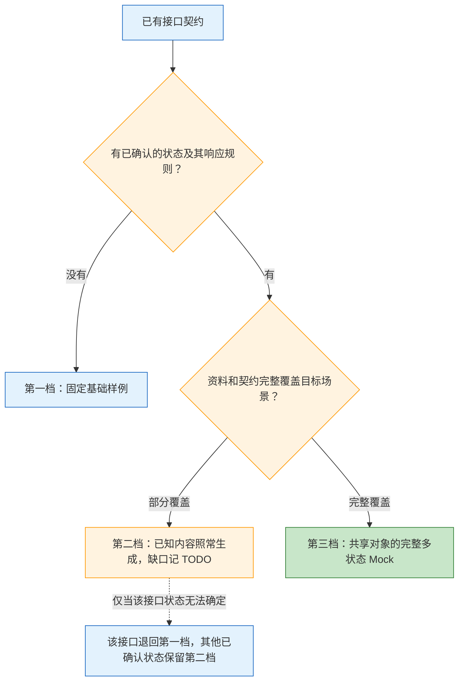

# Mock 分档规则与生成编排

接口生成完成后，按用户要求整理 Mock。每个接口独立判断，同项目可三档并存；局部资料缺口不阻塞其他接口，也不要求所有后端问题关闭后才产出。

## 工作阶段与输入

1. **获取公开契约产物**：使用已生成的契约、OpenAPI、类型和枚举；保留产物版本或来源。业务文档、状态说明、交互原型、已有流程梳理都是可选输入。
2. **固化规则与编排**：提取资料、判断档位，明确样例语义、已确认状态、共享对象、Query 选择方案、覆盖说明及 TODO。本参考负责这一阶段。
3. **实现或完善生成能力**：Faker 自动生成器、多状态产物和 Query 映射在此阶段落地。具体执行能力须从所选 runner 的公开帮助或已有工具说明确认，不能把本参考当作 CLI 已支持的证明，也不能编造参数。

能力尚未实现时，先交付规则、覆盖说明和 TODO，注明“Mock 数据未执行生成”。不要写临时脚本或手改 `.nlab` 绕过缺失能力。后续实现需要独立落实到负责该能力的工具，仍由 CLI 独占原有契约生成流程。

缺少某接口公开契约时，仅记录该接口待补契约，不猜响应结构；继续处理已有契约的接口。可选资料不可访问时，记录来源及访问缺口，按现有信息降级。

## 从资料提取可执行规则

从原型逐页提取状态、按钮、显示及禁用条件、点击效果，映射到实际契约字段和枚举。前端固定渲染的控件只记录依赖条件，不向响应新增字段。

保留每条规则的资料出处，例如文档章节、原型页面或公开契约字段。分别标记资料尚未提取完整、业务规则不明、当前契约缺项、已核实的后端缺陷；不要把所有不足称为“后端未实现”。已有接口缺口文档时复用，只补充条目或引用，不再建立重复台账。

## 按接口选择档位



### 第一档：有契约，无业务流程资料

根据字段名、注释、上下文、类型和枚举，用 Faker 等能力生成一份固定、可复现、有语义的基础样例。缺的是业务流程资料，不是接口契约。

已有字段可以填合法固定样例值；仅有状态枚举、没有各状态的响应规则时，仍属第一档。枚举值合法不代表状态间关系已确认。未确认的业务关系或样例假设放在响应之外的覆盖说明中，不把基础样例当作完整业务状态。

### 第二档：流程或契约覆盖不完整

有什么生成什么：现有字段和已确认状态照常产出，缺少的字段、动作、规则记 TODO。某接口状态无法确定时，该接口退回第一档，不拖住其他接口。

若已有多份确认状态样例，同样可以通过开发 Query 切换。仅列出已覆盖状态，不为凑齐流程补造剩余状态。

### 第三档：目标场景信息完整

围绕共享业务对象生成完整多状态 Mock，通过开发 Query 选择状态。完整指本次约定的场景范围；状态、按钮组合和字段变化均有明确规则及契约依据。

## 语义生成与状态选择

- Faker 负责姓名、地址、商品描述等语义内容，结合语言区域、字段路径、字段上下文和业务样例或词库生成；不能只满足类型却填无意义随机值。
- 规则决定状态、按钮组合、显示和禁用条件。Faker 不随机猜业务规则，不编造契约不存在的字段、接口、枚举或动作码。
- 未知按钮不等于已确认无按钮。若契约允许空列表，可暂用合法空列表，但覆盖说明必须注明按钮行为尚未覆盖；契约不允许时，报告该样例生成受阻。
- 跨状态复用订单、商品及关联标识，按明确规则改变相关字段，保证金额、时间及对象关联一致。不要为每个状态随机换一笔订单。
- 固定并记录 Faker seed、版本、语言区域、参考日期和规则版本；涉及时间的生成显式使用参考日期，保证相同输入得到相同样例。

Query 只用于开发环境选择已知样例，不作为新增业务请求字段。第 2 步明确参数名、可选值、默认样例、未知值处理和跨接口共享场景关系；第 3 步才接入实际读取与映射。遵循项目已有开发选择约定，无约定时提出方案并标为待实现。静态切换不代表按钮操作已经实现跨请求状态流转。

## 当前商户开发项目的 Whistle 写法

本项目已确认：接口路径唯一，开发请求默认 POST，业务参数放在 body，URL 只携带一个 Mock 场景参数。按这个范围生成最直接的静态文件映射：

```text
*/api/detail?__mock=refurbishing file://</Users/example/project/.nlab/semantic-mock/detail.refurbishing.json>
*/api/detail?__mock=qc-completed file://</Users/example/project/.nlab/semantic-mock/detail.qc-completed.json>
*/api/detail file://</Users/example/project/.nlab/semantic-mock/detail.json>
```

示例项目目录仅用于说明格式。实际生成必须使用真实项目绝对路径，不能把它缩成系统根目录下的 /mock。文件目标用尖括号固定，避免追加剩余请求路径。具体场景在前，默认规则最后；不添加 HTTP 协议前缀、精确匹配前缀、includeFilter、excludeFilter、Query 正则或未知场景守卫。沿用原生前缀匹配和默认响应行为，不再声称未知、重复或编码参数必然返回 400。

本轮不处理 GET 业务查询参数、多 Query 的顺序兼容或其他尚未遇到的输入情况；真实需求出现后再决定。保留 JSON 契约校验、同实体场景、绝对文件路径、manifest 和手改保护，不用修改响应数据来简化代理语句。

正式版本 1.11.4 起独立 CLI 公开 Mock 入口；使用前仍按实际帮助确认安装版本。正式命令为 `nlab-api mock --project <frontend>`，可复用项目中的 mock.rules、outputRoot 和 manifest。独立命令的输出目录/seed使用现有CLI默认；需要沿用项目值时显式传入。`generate` 开启 mock.enabled 后调用相同共享生成器。`jt nlab-api mock` 未配置runner或runner为nlab-api时转发独立入口；显式runner为jt时使用内嵌实现。现行本地配置位于 `.nlab/nlab-api.local.json`，旧 `.nlab/cli.local.json` 只作兼容读取。不要为了更新命令偷偷改写用户runner。

已安装受管独立CLI时，更新命令为 `nlab-api update`；JT更新命令为 `jt upgrade`，不存在 `jt update`。只有用户选择独立 CLI 且尚未安装时，才使用项目公开的 install-nlab-api.sh。已有 runner: jt 的项目只需用户执行 jt upgrade，随后继续 jt nlab-api mock；未安装独立 CLI 不是要求迁移的理由。用户明确表示自己更新时只给命令，不代执行全局更新。

现有契约直接调用经帮助确认的 Mock 命令，不重跑后端提取。正式使用仅沿用 nlab-api mock 或按已有 runner 执行 jt nlab-api mock，不引入功能专用命令名。使用 --rules 和 --manifest 前核对实际帮助，已有规则和独立清单时复用它们。

## 输出与验证

每个接口分别报告三个结果：

- **生成结果**：未执行、成功或失败；给出实际产物位置或失败原因。仅整理规则不能称为生成成功。
- **业务覆盖**：档位、已覆盖场景、样例假设和对应资料来源。允许“生成成功，业务覆盖不完整”。
- **剩余缺口**：待补资料、待确认规则、契约缺项或已核实缺陷，引用已有台账；同时列出待实现的生成或选择能力。

第 2 步检查字段及枚举映射、状态规则出处、分档和降级是否正确。第 3 步落地后，由负责 Mock 的 CLI 或工具自动验证契约合法性、固定输入复现、语义内容、跨状态对象一致性及 Query 选择结果；本 Skill 读取并反馈报告，不额外启动测试。没有执行这些检查时，不声称生成器或业务链路已验证。

## 三种输入示例

**无流程资料**：订单详情契约包含订单标识、商品名称和状态枚举，未提供流程说明。选第一档，规划一份固定的订单样例，状态取契约合法值；覆盖说明注明状态与按钮关系未确认。生成能力未就绪时仅交付该规则，不声称已有数据产物。

**部分覆盖**：资料确认订单“待处理”和“已完成”两种场景及相应字段规则，但取消动作的规则尚不明确。选第二档，生成能力就绪后产出两份共享订单标识的样例，允许 Query 选择；取消规则记 TODO。若另一个接口没有可确认状态，该接口单独走第一档。只有需求需要而契约不存在的字段才记契约缺项，不添加假字段。

**完整信息**：目标范围内的订单状态、按钮条件、字段变化和关联关系均有资料且映射到实际契约。选第三档，围绕同一订单和商品规划所有已确认状态及 Query 映射；第 3 步实现后验证每个选择结果。示例中的中文状态名称只是场景称呼，实际响应只使用目标契约已有值。
