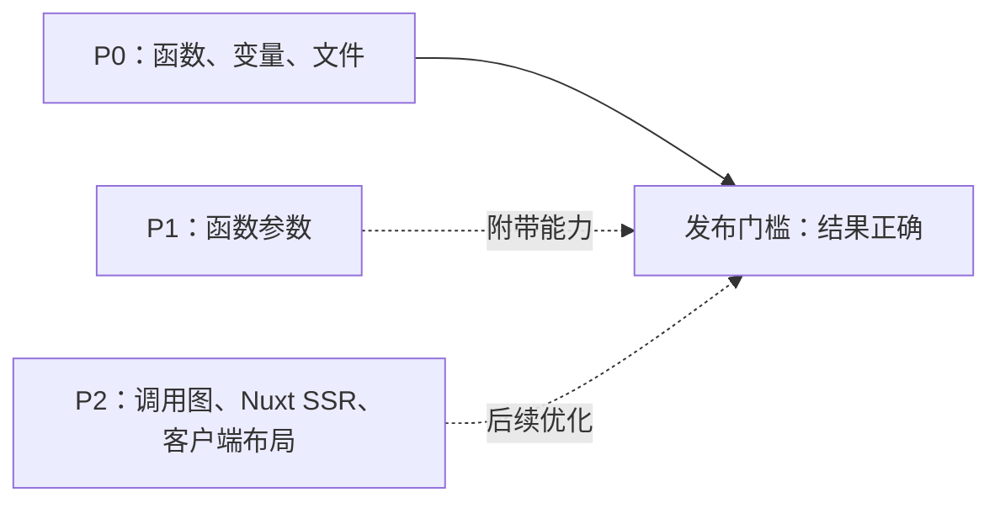
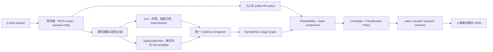
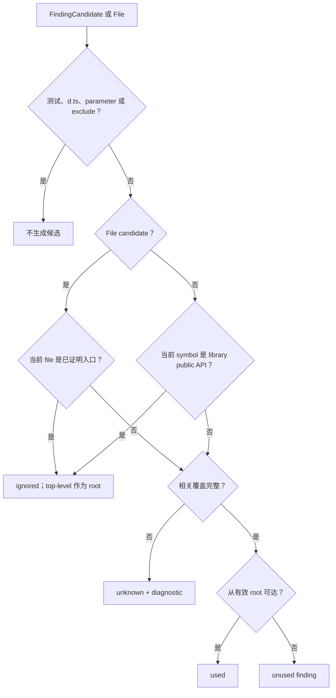

# JT 未使用代码分析技术设计

- 状态：Proposed
- 核心目标：正确找出未使用的函数声明、变量声明和文件
- MVP 指令：`jt code unused [PATH]`
- 支持语言：JavaScript、TypeScript、JSX、TSX、Vue SFC

## 1. 目标与优先级

本功能首先回答一个问题：仓库中的哪些函数声明、变量声明和文件没有被任何有效代码路径使用？

结果必须适合人工确认和后续清理。普通 finding 可以直接定位声明；`reexport-only` file finding 表示“文件及其转发可以一起移除”，不能只 `rm` 文件而保留 barrel 语句。工具不自动修改源码。证据不足时必须返回 `unknown` 或 diagnostic，不能把不确定项报告为 `unused`。

正确性优先级：先保证 precision，再提高 recall。漏报可以通过补 analyzer 和 policy 继续收敛；误报可能让用户删除仍在运行的代码，发布门槛必须更严格。



优先级含义：

1. P0 决定本功能是否完成。
2. 函数参数属于附带能力。MVP 不扫描、不输出参数 finding。
3. Nuxt SSR 查询和客户端图布局不属于 MVP。当前 Inspector 保留为实验工具，不阻塞 unused 交付。

## 2. MVP 范围

### 2.1 Finding 类型

| CLI kind | 包含 | 不包含 |
| --- | --- | --- |
| `function` | 函数声明、对象方法、类方法、getter、setter | constructor、函数参数、类型签名、未绑定匿名回调 |
| `variable` | `const`、`let`、`var`、每个解构绑定，包括保存函数表达式或箭头函数的变量 | import binding、函数参数、catch binding、class field、纯类型声明 |
| `file` | 配置 roots 内的运行时源码文件 | 测试文件、`*.d.ts`、已证明的入口文件、用户 exclude 文件 |

`const load = () => {}` 按变量声明报告为 `variable`，避免同一声明同时成为 function 和 variable finding。参数绑定必须通过声明 AST 角色排除，不能只依赖 Oxc `SymbolFlags::Variable`；`FunctionScopedVariable` 可能同时包含参数。

Function candidate 只表示有 runtime body 的实现。TypeScript overload/declare signature、abstract method、interface/type member 不生成 candidate；对应 implementation 有 body 时只生成一个 candidate。Object literal 的 `ObjectProperty.method=true`、`PropertyKind::Get/Set` 必须生成 method/getter/setter candidate；getter 与 setter 使用不同 discriminator。Computed key 只有能静态命名且 key effect 完整时才生成确定 candidate，否则进入 unknown/diagnostic，不能静默漏扫。

`.json`、`.html`、`.css`、图片和其他资源不作为 file candidate。HTML 只用于入口证据；已知 JSON/CSS/asset import 记录资源依赖但不生成 P0 finding。Virtual module、loader query 或未知扩展若可能生成代码：bounded prefix/manifest 只污染匹配 scope；完全无 target 边界时，把 configured roots 内可能被生成代码消费的 file/exported symbol coverage 降级 unknown，不能只污染 importer 后继续输出 target finding。

FindingCandidate 与 ExecutionOwner 必须分开。constructor、class static block、class-field initializer、匿名 callback、IIFE 和 file top-level 不属于本期 finding，但必须保留为内部 ExecutionOwner；reachable owner 中的调用和读取仍能保护 P0 target。例如 `new Service()` 使 constructor owner reachable，constructor 内调用的 helper 不能误报 unused。

变量 binding 与 initializer 行为也必须分开。未读取 binding 的 initializer 已证明 pure 时可普通清理；initializer side-effectful 时仍可报告 `unused-binding-side-effectful-initializer`，但含义是移除 binding、保留表达式行为；initializer effect 无法证明时结果为 unknown。解构 RHS、computed key 和 decorator 同样进入 effect coverage。

### 2.2 非目标

MVP 不处理：

- 未使用函数参数；
- class、interface、type、enum 的未使用检测；
- Rust、Java 等其他语言；
- 自动删除或修改源码；
- 公开的 `index`、`status`、数据库管理指令；
- 新的调用图 UI、Nuxt runner 或客户端布局方案；
- 对反射、远程配置和任意运行时字符串的完全证明。

TODO（后续）：把框架应用入口与 `*.d.ts`/自动生成声明文件作为独立的非 finding 类型暴露给 explain/Inspector；MVP 内部已分别按 `entrypoint` 与 type-consumer-only 处理，不把它们混入 unused。

## 3. CLI 设计

当前基线与目标：

| 能力 | 当前 | 本设计 |
| --- | --- | --- |
| unused 入口 | `jt unused` | 新增 `jt code unused`，旧入口兼容 |
| unused 数据源 | 一次内存扫描 | 保持一次内存扫描，强化 analyzer 和 policy |
| call graph | `jt call-graph` 单独生成 HTML/SQLite | 保持独立，不纳入 MVP |
| Nuxt Inspector | 实验性 SQLite consumer | 后续重做，不参与发布门槛 |

### 3.1 目标指令

```text
jt code unused [PATH]
  --kind function,variable,file
  --mode app|library
  --json
```

行为：

- `PATH` 默认是当前目录；可传项目根、子目录或单个文件。
- jt 向上寻找最近的 JavaScript/TypeScript 项目根。
- 项目按配置 roots 完整分析，`PATH` 只缩小输出 scope。
- 默认扫描 `function,variable,file`。
- 找到 unused 仍退出 `0`；运行失败退出 `1`；Clap 参数错误退出 `2`。
- `--json` 只向 stdout 写完整 JSON。警告和错误写 stderr。

### 3.2 兼容指令

现有 `jt unused` 保留为兼容入口，并调用同一实现：

```text
jt unused ... == jt code unused ...
```

两条指令必须产生相同 finding、排序、JSON 和退出码。下个 major 之前不删除旧入口。

现有 `jt call-graph` 保持独立，不是 `unused` 的前置步骤。MVP 不新增 `jt code graph`。

### 3.3 配置

继续使用现有 `.nlab/unused.config.json`，不为命令重组引入新配置路径。配置 version 2 增加可选 `entrypoints`；新 CLI 同时读取 version 1：

```json
{
  "version": 2,
  "roots": ["src"],
  "entrypoints": ["src/main.ts"],
  "exclude": [
    "src/generated/**",
    "src/mock/**"
  ]
}
```

规则：

- `roots`、`entrypoints` 和 `exclude` 都是项目相对路径。
- version 1 文件格式继续兼容；新 analyzer 对 version 1/2 的 exclude 都采用“隐藏 candidate、保留 consumer evidence”的安全语义，主动修复旧 hard-exclude 可能制造的 false positive。version 2 只增加 `entrypoints`。不自动改写用户文件。
- `entrypoints` 可选；用于自定义运行时入口。标准框架入口可以自动识别，但必须有 package、HTML 或框架约定证据，文件名叫 `main` 本身不够。
- 拒绝绝对路径、`..`、未知字段、未知版本和越过项目根的 symlink。
- exclude 文件不产生 candidate/finding，但仍做 consumer-only 扫描，保留它们对 roots 内手写代码的真实调用、引用和 import 证据，避免 generated/bootstrap 目录造成 false positive。
- 测试文件使用内置规则过滤，不要求每个项目重复配置。
- tests 和 roots 外文件是 hard boundary：既不产生 candidate，也不作为 production consumer。`*.d.ts` 不产生 P0 candidate，但进入 type consumer-only pass；其中 `typeof import('./runtime').foo` 等 exact type usage 必须保护目标 value declaration/source file。`roots` 定义分析宇宙，必须在 Report 中明确展示。
- 无法建立完整入口集合时，受影响的全局文件可达性为 `unknown`，不能继续输出确定的 file finding。

## 4. 正确性原则

### 4.1 Finding 的含义

`unused` finding 表示：

1. 工具已完整解析该声明或文件；
2. 工具已建立当前项目范围内的引用、调用、模块和入口证据；
3. 声明或文件不在任何有效使用路径上；
4. 没有命中入口、测试、公共 API 或动态边界保护规则。

只满足“没有找到引用”不够。两个声明互相调用、两个文件互相 import，但整个连通分量没有外部入口时，它们仍可能整体未使用。分析覆盖不完整时必须返回 `unknown`。

### 4.2 四种结果

| 状态 | 含义 | 是否进入 findings |
| --- | --- | --- |
| `used` | 存在有效引用或保守的动态使用证据 | 否 |
| `unused` | 覆盖完整，且没有有效使用证据 | 是 |
| `ignored` | 入口、公共 API、约定忽略项 | 否 |
| `unknown` | 解析失败、语义服务缺失或运行时目标无法安全判断 | 否 |

测试文件和用户 exclude 文件在候选生成前过滤，不进入四种结果。

### 4.3 必须保持的不变量

1. Symbol 使用按 target ID 关联，不按名称全局猜测。
2. `export` 只描述可见性，不代表使用。
3. barrel re-export 不代表 symbol 被消费。非 type re-export 会触发 ESM module load，必须单独记录；只有目标文件顶层 side-effect-free 时，才允许把“仅被 re-export”作为 file unused finding。
4. import 声明存在但 import binding 未读取，不代表被导入 symbol 已使用。
5. type usage 可以保护被引用的函数/变量声明和 source file，但不传播 runtime reachability；side-effect import 传播 runtime file reachability。
6. app 模式要求仓库内真实消费者；library 模式只保护 package 公共入口可达的 API，不保护所有 internal export。
7. 互相引用但没有外部入边的 symbol/file 分量不能因内部引用被判为 used。
8. 名称以 `_` 开头不自动忽略。参数不是本期 candidate，因此无需借下划线隐藏参数噪声。
9. 同名声明按文件、作用域和 symbol ID 独立判定。
10. line 和 column 对外统一使用 1-based。
11. 输出按 path、line、column、kind、name、id 稳定排序。

## 5. 核心分析流程

MVP 继续复用现有 `build_evidence()`，一次扫描生成内存快照。unused 不依赖 SQLite，也不依赖 call graph HTML。



### 5.1 Source discovery

Source discovery 负责：

- 确定项目根和输出 scope；
- 应用 roots、exclude 和内置目录过滤；
- 读取支持文件；
- 提取 Vue `<script>` 和 `<script setup>`；
- 收集显式 `entrypoints`、Vite HTML module script、app 的 package `bin`、library 的 `main/module/bin/exports` 和已支持框架约定；
- 记录读取失败和 SFC parse diagnostics。

测试路径至少覆盖：

- `test/`、`tests/`、`__tests__/`、`e2e/`、`cypress/`；
- `*.test.*`、`*.spec.*`、`*.e2e.*`；
- `test_*`、`*_test.*`。

测试文件在候选及 consumer 生成前 hard filter。`*.d.ts` 与 exclude 文件只跳过 candidate，分别进入 type consumer-only 和普通 consumer-only pass；其中 parse/resolution 失败时按可定位 target 传播 coverage issue，不能静默忽略。自动入口识别失败时不再用 `main.*` 文件名兜底；输出 `entrypoint-coverage-incomplete` diagnostic，并把受影响 file reachability 降级为 `unknown`。

#### 5.1.1 MVP 入口证据

入口按下面顺序合并、去重：

1. version 2 `entrypoints` 显式配置；
2. root HTML 中 literal `<script type="module" src="...">`；
3. `package.json` 的 `bin`，以及 library 模式的 `main`、`module`、`exports`；
4. `package.json` scripts 中可静态解析的直接执行：`node`、`bun`、`deno run`、`tsx`、`ts-node`、`vite-node` 后的 root-relative source path；不执行 shell，不解析变量替换和 command substitution；
5. Vue CLI/Vite 继续优先使用 HTML 入口。检测到 Nuxt/Next convention、auto-import 或 virtual module 时，MVP 不猜 file root/consumer；若 Volar/TypeScript 未通过生成的 virtual types 给出 exact target，记录 `framework-semantic-incomplete` 并将受影响 file/symbol 降级 unknown。

script 含 shell pipeline、环境变量拼接、运行时计算或未知 launcher，且没有 HTML、配置或 package source entry 可证明入口时，记录 `entrypoint-script-unsupported`。如果所有入口来源都为空，file finding 和依赖全局 reachability 的 exported symbol 为 unknown，并提示配置 `entrypoints`；非 exported 的文件内声明仍可做局部可达性分析。

MVP fixtures 必须分别覆盖配置、HTML、Node/Bun/tsx script、package public surface、unsupported script，以及 Nuxt/Next/auto-import 的明确降级。Nuxt/Next convention adapter 属于后续阶段。完成定义中的“首次直接运行”只对自动识别成功或已配置 entrypoints 的项目承诺可信 file finding；否则必须明确降级，不得伪装成功。

### 5.2 Oxc pass

Oxc 是语法和模块关系的基础层，负责：

- 收集 function、method、variable candidates；
- class method 从 runtime `MethodDefinition` 收集；object method/getter/setter 从 `ObjectProperty.method` 与 `PropertyKind::Get/Set` 收集；排除 abstract/declare/overload-only 节点；
- 依据 declaration AST role 排除 parameter、catch binding、import binding、class field；
- 独立收集 constructor、static block、field initializer、callback、IIFE、file top-level 等 ExecutionOwner；
- 记录局部 read/reference 的 source owner 与 target ID，不只保存 `local_used` 布尔值；
- 收集 import、type import、local export、re-export、`export *`；
- 收集静态、pattern、unbounded dynamic import、`import.meta.glob`、literal/dynamic `require()`；
- 解析 CommonJS `module.exports`、`exports.name`、`module.exports = { ... }` 的 exact public/consumer linkage；无法静态解析的 CommonJS export 使对应 package/file coverage unknown；
- 分开生成 value import、type import、side-effect import、re-export、local call/reference 和 file dependency evidence；
- 为 variable/destructuring initializer、computed key、decorator 记录保守 effect summary；
- 保守计算 top-level side-effect summary；任何无法证明纯净的表达式都记为 `unknown`，不因 re-export-only 产生危险 file finding；
- 记录 parse/semantic errors。

Oxc 不负责 Vue template，也不单独证明所有跨文件 target。

### 5.3 TypeScript/Volar pass

项目安装了 TypeScript/Volar 时，bounded Node helper 负责：

- 使用 TypeScript Program 解析跨文件 symbol identity；
- 按 tsconfig/jsconfig 解析 path alias，包括配置完整时的 `@/...`；
- 为 ordinary read、call、函数值传递、namespace import、方法引用记录 source owner 和 exact target ID；
- 使用 Volar virtual files 解析 Vue template；
- 为 `<Card :loading="loading" />` 分别产生 `Card` 和 `loading` 的引用证据。

Helper 不自动安装依赖，超时为 120 秒。缺失 TypeScript、vue-tsc 或 `@vue/compiler-sfc` 时，只允许 Oxc 已能完整证明的非 exported、非 Vue 局部声明继续判定；跨文件、方法、Vue template 和 file reachability 受影响项进入 `unknown`。

内部 alias 或 module 无法解析时，必须把对应 coverage 标为不完整。方法只按名称匹配时只能产生 `potential` 和 ambiguity candidates，不能产生 exact usage。

Helper 会加载目标项目的已安装依赖。用户只应在可信工作区运行。

### 5.4 Evidence Snapshot

Evidence Snapshot 是分类器的唯一输入：

```text
FindingCandidate
  id, kind, name, qualified_name, path, span
  exported, structural_role
  initializer_effect: none | side-effect-free | side-effectful | unknown

ExecutionOwner
  id, kind, path, span
  kind: file-top-level | function | method | constructor | static-block
        | field-initializer | variable-initializer | callback | iife
  finding_candidate_id?

UsageEvidence
  source_owner_id, target_id, kind
  confidence: exact | potential
  mode: runtime | type
  path, line, column, provenance

FileEvidence
  source_file, target_file
  kind: value-import | type-import | side-effect-import | dynamic-import
        | reexport | type-reexport
  binding_read, runtime_load, confidence

SideEffectSummary
  file_id
  top_level: side-effect-free | side-effectful | unknown

EntryEvidence
  file_id, source: config | html | package | framework

CoverageMap
  candidate_id | file_id -> CoverageObligations

CoverageObligations
  syntax_complete
  module_resolution_complete
  semantic_complete
  vue_template_complete
  dynamic_complete
  entrypoint_complete

CoverageIssue
  code, source_path, line
  affected_candidate_ids[]
  affected_file_ids[]
  affected_resolution_prefix?
```

`source_owner_id` 指向 ExecutionOwner。某些 owner 同时对应 FindingCandidate，constructor/static block/callback 等只参与执行图、不输出 finding。分类器由此区分“被真正执行路径引用”和“只被另一个 dead owner 引用”。当前 `Candidate.local_used`、`used_files` 只能作为迁移期派生值，不能继续作为分类事实源。

Coverage 必须 keyed，不能是全局布尔值：parse error 默认只污染同文件 candidates；bounded unresolved import/virtual module 污染 importer 和可定位 target/prefix；Volar 缺失污染 Vue template 相关 candidates；unbounded dynamic import/virtual module 污染其 resolution universe，完全无边界时至少覆盖 configured roots 的 file/exported symbols；entrypoint 不完整污染 file nodes 与依赖全局可达性的 exported symbols。无关干净目录仍可输出确定 finding。

CodeGraph 不作为 unused 的事实源。它可以辅助其他功能，但当前节点和边不足以单独覆盖 TypeScript symbol linking、Vue template 和 re-export 消费语义。

## 6. 分类算法

分类器必须是纯逻辑：相同 Candidate、Evidence、EntryEvidence 和 CoverageMap 必须产生相同结果。实现时应从命令编排中提取 usage graph、reachability 和 classification policy，用表驱动单元测试锁定规则。



### 6.1 两层 usage graph

File graph：

- root 是显式 entrypoint、Vite HTML 入口、已支持框架入口；library 模式 root 是 package 公共入口；
- entrypoint 只在 file 粒度为 `ignored: entrypoint`，同时其 top-level owner 成为 traversal root；入口文件内的函数和变量继续参与 P0 分析，不能因所在文件是入口而整体 ignored；
- value import、side-effect import、真实消费后的 barrel chain、static/pattern dynamic import、literal require、literal `import.meta.glob` 匹配产生可达边；
- type-only import 记录 compile-time usage：保护 exact symbol 和 source file，但不继续遍历该文件的 runtime imports；
- `export type` 不产生 runtime load，但必须保留 type forwarding chain；下游 exact type usage 沿 chain 保护原 value declaration 和 source file，不传播 runtime imports。普通 re-export 记录 `runtime_load=true`，但不产生 symbol consumer evidence。按产品定义，即使 barrel reachable，side-effect-free 且无真实消费者的 target file 仍可报告 `reexport-only`，finding 必须携带全部 reexport locations，表示需要连同转发一起清理；side-effectful 时沿 runtime-load 边保护，side-effect unknown 时 file 为 unknown。library public surface 上的 re-export 仍由 external API policy 保护；
- potential dynamic edge 为避免误删可以传播 reachability，但必须保留 `confidence=potential`；
- 无界动态路径使受影响 resolution scope 的 file coverage 变为 unknown，不伪造“全部 used”的具体边。

Symbol graph：

- 每条 read/call/reference 都必须保留 source owner；
- reachable file 的 top-level owner 是 symbol traversal root；
- reachable function/method/initializer 才能继续传播它内部的引用；
- `new Class()` 使对应 constructor、instance field initializer reachable；reachable class evaluation 使 static block/static field initializer reachable；IIFE 为 exact owner，传给可执行 API 但无法证明调用时的 callback 为 potential owner；
- library public API symbol 直接作为外部 root；
- exact type usage 保护 target declaration，但不遍历 target 的 runtime body；
- exact 和 bounded potential edge 都可保护 target；name-only、反射字符串和无法界定 target 的 edge 只能进入 unknown。

普通“是否存在入边”不够。下面两个声明互相调用，但没有 top-level、entrypoint 或 public API 入边，两者都应是 unused：

```ts
function a() { b() }
function b() { a() }
```

当入口集合已完整建立时，互相 import 但没有入口可达的文件分量仍是 unused。入口集合为空或探测失败时，file/global exported symbol 必须 unknown，不能把“未发现 root”误当成“存在 root 但 cycle 不可达”。实现只需从 root 做确定性 DFS/BFS；无需单独实现 SCC 算法。

入口覆盖不完整时，file finding 和依赖全局 reachability 的 exported symbol 必须降级 unknown；非 exported 的文件内声明仍可从该文件 top-level owner 做局部可达性判断，不需要把整个仓库全部降级。

### 6.2 函数和变量

函数或变量成为 `unused` 的必要条件：

- 不可从 reachable top-level、函数、方法、initializer 或 library public root 到达；
- 没有 Vue template exact reference；
- 没有有限 registry/dynamic dispatch 的 potential evidence；
- app 模式下即使 exported，也没有真实消费者；
- 相关 syntax、module resolution、semantic、template 和 dynamic coverage 完整。

Variable binding 不可达后再看 initializer effect：`side-effect-free/none` 使用普通 finding；`side-effectful` 使用 `unused-binding-side-effectful-initializer`，要求清理时保留 RHS 行为；`unknown` 进入 unknown。MVP 不提供自动 rewrite。

方法调用无法解析到唯一实现时，相关实现进入 `unknown`，不能仅按同名方法判 used，也不能报告 unused。

### 6.3 文件

文件成为 `unused` 的必要条件：

- 不是测试、declaration 或明确入口；
- 不在用户 exclude；
- 不可从 app/library root 经 value import、side-effect import、dynamic import 或真实消费后的 barrel edge 到达；raw re-export runtime-load 按下述 `reexport-only` 特例处理；
- 没有 exact compile-time file usage；
- 没有真实消费者沿 re-export chain 到达该文件；
- 文件 parse、module resolution、entrypoint、dynamic 和 top-level side-effect coverage 完整。

仅被 `index.ts` re-export、没有真实 symbol consumer 且已证明 top-level side-effect-free 的文件仍是 `unused` 候选，reason 为 `reexport-only`。存在顶层 call/new/assignment/await、class static block、无法证明纯净的 initializer 或 parser 不支持语法时，不得输出该 file finding。

### 6.4 App 与 library 模式

`app` 是默认模式：

- export 本身不算使用；
- re-export 本身不算使用；
- 必须找到仓库内真实消费者。

`library` 模式：

- 只把 package `exports`、`main`、`module`、`bin` 声明的入口及其 re-export closure 视为外部 API，结果为 `ignored: external-api`；
- CommonJS 入口只保护静态可解析的 `module.exports` / `exports.name` closure；动态 export 不猜测，降级 unknown；
- internal file 中普通 exported 声明仍需真实消费者；
- 未 exported 的声明仍按普通规则检测。

## 7. 关键语义规则

| 场景 | 证据 | 结果 |
| --- | --- | --- |
| reachable owner 中 `foo()` 或读取变量 | exact call/reference target ID | target `used` |
| dead owner 中 `foo()` 或读取变量 | edge 存在，但 source owner 不可达 | 不能单独保护 target |
| `const setup = registerPlugin()`，setup 未读取 | binding unused + side-effectful initializer | finding=`unused-binding-side-effectful-initializer`；保留 `registerPlugin()` 行为 |
| initializer effect 无法证明 | effect coverage incomplete | variable `unknown` |
| import binding 在正文被读取 | value import + exact reference | 目标 symbol `used`；目标 file reachable |
| value import 存在但 binding 未读取 | 只有 runtime module edge | 目标 symbol 仍可能 `unused`；目标 file 为避免遗漏 side effect 仍 reachable |
| `import type { value }` + `typeof value` | exact type usage | 保护 value declaration 和 source file，但不传播 runtime reachability |
| 经 `export type` barrel 后 `import type` + `typeof` | exact type forwarding chain | 保护原 value declaration/source file，不传播 runtime reachability |
| `import './setup'` | side-effect import edge | 目标 file reachable |
| `index.ts` 只 re-export | symbol forwarding + file runtime-load edge | 原 symbol 仍可能 `unused: reexport-only`；side-effect-free source file 可报告，但必须连同 finding.reexports 中的转发一起清理 |
| re-export 目标有顶层副作用 | runtime-load + side-effect evidence | reachable barrel 会保护 source file，但不保护未消费 symbol |
| 从 index 导入后实际调用 | 沿 re-export chain 解析到原 ID | 原声明 `used` |
| `import('./Page.vue')` | exact dynamic file edge | 文件 `used`；其 exported symbols 保守进入 `unknown`，除非属性访问可解析 |
| <code>import(&#96;./views/${name}.vue&#96;)</code> | pattern 匹配后的 potential file edges | 匹配文件 `used`；相关 exported symbols `unknown` |
| `import(runtimePath)` | 无静态边界 | 受影响 resolution scope 的 file/symbol coverage 为 `unknown`；不伪造 target edge |
| literal `import.meta.glob('./views/*.vue')` | bounded glob file edges | 匹配 file reachable；exported symbols unknown，除非 exact property/binding usage 可解析 |
| unresolved `import.meta.glob(pattern)` | 无 bounded glob | 对应 resolution scope unknown |
| `require('./service')` | exact CommonJS file edge | 目标 file reachable；可解析 binding/property 保护 exact symbol |
| `require(runtimePath)` | 无静态边界 | 对应 resolution scope unknown，不输出确定 file/exported symbol unused |
| `module.exports` / `exports.load` | exact CommonJS export evidence | app 模式仍需消费者；library public entry closure 保护 exact API |
| 动态计算 CommonJS export | export coverage incomplete | 对应 package/file/exported symbol `unknown` |
| `<Card :loading="loading" />` | Volar template references | `Card` 和 `loading` 分别 `used` |
| `handlers[action]()` | 可枚举 registry targets | targets 获得 potential usage，视为 `used` |
| `container.resolve('Foo')` | 无已知 registry adapter | 不按名称猜测；相关候选 `unknown` 或 diagnostic |
| 两个函数只互相调用 | 无 reachable 外部入边 | 两者 `unused` |
| 已知 entry root 之外，两个文件只互相 import | entrypoint coverage complete，cycle 不可达 | 两个 file `unused` |
| 未发现任何可信 entry root | entrypoint coverage incomplete | file/global exported symbol `unknown` |
| 已配置或已证明的 app entry file | config/HTML/framework evidence | file 为 `ignored: entrypoint` 且 top-level 为 root；内部函数/变量继续分析 |
| 仅文件名为 `main.*` | 无入口证据 | 不自动忽略；coverage 不完整时 `unknown` |
| `*.d.ts` | 非 P0 target，但可包含 exact type consumer | 不生成候选；type usage 可保护 roots 内 value declaration/source file |
| 测试路径 | 内置测试过滤 | 不生成候选 |
| `_helper` 无引用 | 下划线不是 ignore policy | `unused` |
| 函数参数无引用 | 非 P0 candidate | 不生成 finding |
| unresolved internal alias/module | module coverage 不完整 | 受影响项 `unknown`，不按名称猜测 |
| unbounded `virtual:*` / loader-generated module | 无可证明 target | configured roots 内可能被生成代码消费的 file/exported symbol `unknown` |

动态策略以避免误删为先。它可能减少 file finding，但不能制造具体目标的虚假 exact edge。

## 8. 输出合同

### 8.1 Finding

```json
{
  "id": "stable-symbol-id",
  "kind": "function",
  "language": "typescript",
  "name": "loadData",
  "qualifiedName": "loadData",
  "path": "src/load.ts",
  "line": 12,
  "column": 1,
  "reason": "no-inbound-usage",
  "reexports": []
}
```

稳定 reason：

- finding：`no-inbound-usage`、`unreachable-from-entrypoint`、`reexport-only`、`unused-binding-side-effectful-initializer`；
- ignored：`entrypoint`、`external-api`；
- unknown：`parse-errors`、`module-resolution-incomplete`、`semantic-analysis-incomplete`、`vue-semantic-unavailable`、`dynamic-import-boundary`、`dynamic-require-boundary`、`glob-boundary`、`virtual-module-boundary`、`commonjs-export-incomplete`、`framework-semantic-incomplete`、`entrypoint-coverage-incomplete`、`runtime-dispatch-ambiguous`、`initializer-effect-unknown`、`top-level-side-effect-unknown`。

`unreachable-from-entrypoint` 表示 owner file 不可达，即使声明在文件内部存在局部引用也仍属死代码级联；`no-inbound-usage` 仅用于 owner file 已可达、声明本身没有消费证据的场景。

ID 必须在相同源码输入的重复运行中确定一致，并区分同文件同名声明；MVP 不承诺声明移动或前方插入代码后 ID 不变。

Coverage、owner-target Evidence 和 DecisionTrace 是内部 policy 模型，不加入 MVP Finding/Report JSON，避免破坏当前 CLI contract。单元测试和真实项目验证 harness 可以直接读取内部 DecisionTrace；用户输出通过稳定 reason、unknown 项和关联 path/line diagnostic 解释降级原因。后续若确有用户侧 explain 需求，再单独设计，不在本期增加 flag。

### 8.2 Report

JSON 保持当前结构：

```text
root, scope, scanRoots, exclude, mode
findings[], ignored[], unknown[], diagnostics[], summary
```

Summary 至少包含：

```text
scannedFiles, scannedSymbols
functions, variables, files
ignored, unknown, diagnostics
```

Human output 和 JSON 必须来自同一个 Report。Formatter 不参与判定。Diagnostic 必须能按 path/line 与 unknown 关联，但不需要暴露完整内部图。

## 9. 持久化决定

MVP 不新增共享数据库，也不要求用户先执行索引命令。

原因：

- unused 正确性来自 analyzer 和 policy，不来自 SQLite；
- 当前 `jt unused` 已有一次进程内的 Evidence pipeline；本设计扩展其语义，无需先持久化；
- 先设计数据库会扩大 schema、freshness、migration 和并发范围，却不能自动提高判定正确率；
- 当前 Nuxt Inspector 和客户端布局需要重做，不应反向约束核心模型。

未来图形化功能可以序列化同一 Evidence Snapshot，但必须满足：

1. 不重新扫描或重新分类；
2. 不定义第二套 used/unused 规则；
3. Inspector 只展示核心分析结果；
4. 数据库和布局失败不影响 `jt code unused`。

## 10. 最小实现方案

### 10.1 CLI 重组

在 `apps/jt/src/main.rs` 增加 `code` 二级入口和 `unused` 三级命令。新旧入口都调用现有 `unused::run`。

```text
Commands::Code(CodeCommand::Unused(args))
Commands::Unused(args) // compatibility
```

不复制参数结构，不复制 handler，不改变当前 JSON contract。

### 10.2 正确性改造

当前实现与目标差异：

| 当前事实 | 问题 | 目标 |
| --- | --- | --- |
| `Candidate.local_used: bool` | 不知道引用来自 reachable 还是 dead owner | 保存 owner-target usage edge，分类后派生 used |
| `used_files: Set<path>` | import、type import、dynamic、re-export 语义混合 | 使用分类型 file edge 和 root reachability |
| Oxc `SymbolFlags::Variable` | 参数可能混入 variable candidate | 结合 declaration AST role 过滤 |
| finding candidate 同时承担 caller owner | constructor/static block/callback 等非 finding 执行路径可能丢失 | 分离 FindingCandidate 与 ExecutionOwner |
| helper 失败只追加 diagnostic | 非 Vue/exported candidate 可能继续误报 unused | per-candidate Coverage gate |
| unresolved internal module 未进入 file 分类 | 可能在解析缺口下报告 unused | 传播 `module-resolution-incomplete` |
| `structural_ignore(path)` 同时作用于 file 和内部 symbol | `main.*` 会隐藏整个入口文件内的死 helper | 入口证据只忽略 file node，并把 top-level 设为 root；内部声明照常分析 |
| `_name` 自动 intentional ignore | 会漏掉用户目标内的函数和变量 | 下划线不影响 P0 分类 |
| library 模式保护所有 export | internal export 漏报 | 只保护 package public surface closure |

优先修改共享分析路径：

1. 候选生成按 AST declaration role 排除参数等非目标，同时保留非 finding ExecutionOwner；
2. 把 Oxc 和 sidecar 的 read/call/reference 改为带 source owner 的 Evidence；
3. 为 exclude 增加 consumer-only pass，为 re-export target 增加保守 top-level side-effect summary；
4. 构建 file graph、symbol graph、entry roots，执行确定性 reachability；
5. 把 unresolved module、helper 缺失、Vue template、dynamic boundary 收敛到 keyed CoverageMap；
6. 把 candidate/file 分类提取为纯 policy，为每项保存 reason、coverage 和 decision trace；
7. 补齐 reachability、Vue template、re-export、dynamic import、registry dispatch fixtures；
8. 只在所有适用 coverage 完整且不可达时产生 finding。

`call-graph` 可以继续读取 `build_evidence()`，但不得推动 MVP 增加数据库或 UI 工作。

### 10.3 文件组织

保留现有结构，只增加必要代码：

```text
apps/jt/src/
├── main.rs
└── unused.rs
    └── unused/
        ├── oxc.rs
        ├── sidecar.rs
        ├── policy.rs      # 纯分类规则
        └── call_graph.rs  # 保持独立
```

参数分析以后单独扩展 `UnusedKind::Parameter`，不能混入本次完成定义。

## 11. 测试设计

### 11.1 Golden fixtures

保留现有 `unused-golden` 和 `unused-semantic-golden`，增加以下固定答案：

| Fixture | 必须证明 |
| --- | --- |
| direct usage | direct call/reference 不进入 findings |
| declaration only | 无引用函数、变量进入 findings |
| candidate boundaries | method 映射 function；箭头函数变量映射 variable；parameter/catch/import/class field 不生成 candidate |
| object methods/accessors | object method、getter、setter 分别产生 function candidate；computed key effect 被记录 |
| runtime implementation only | abstract/declare/overload-only signature 不生成 candidate；有 body implementation 只生成一次 |
| non-finding owners | constructor、static block、field initializer、IIFE、reachable callback 内引用能保护 target，但 owner 自身不输出 finding |
| destructuring | 每个 variable binding 独立判定 |
| initializer effects | pure initializer 普通 finding；side-effectful initializer 使用专用 reason 并保留行为；unknown effect 不误报 |
| underscore | `_helper` 无引用仍进入 findings |
| unused import | value import 未读取不保护目标 symbol；runtime file edge 仍存在 |
| type-only import | `typeof` 等 exact type usage 保护对应 value declaration 和 source file，但不传播 runtime imports |
| type re-export chain | `export type` + downstream `import type/typeof` 能解析并保护原 value declaration/source file |
| barrel only | re-export-only function 进入 findings；side-effect-free source file 进入 findings |
| barrel side effect | reachable barrel 不消费 symbol；有顶层副作用的 source file 不进入 findings |
| barrel consumed | 真实下游消费沿 chain 保护原声明 |
| same name | 不同文件、作用域的同名声明按 ID 分开 |
| dead symbol cycle | 互相调用但无 reachable owner 的函数都进入 findings |
| dead file cycle | fixture 含一个已知 entry root；root 外互相 import 的文件 cycle 都进入 findings |
| missing entry root | 无可信 entry 时 file/global exported symbol 为 unknown，不与 dead cycle 混淆 |
| Vue template | `Card`、`loading`、event handler 分别被识别 |
| static dynamic import | 目标 file used；无法解析的 exported API 为 unknown |
| pattern dynamic import | 只保护 pattern 匹配文件 |
| unbounded dynamic import | 受影响 scope 为 unknown，不伪造全部 file used edge |
| import.meta.glob | literal glob 保护匹配 file、exported symbol unknown；unresolved glob 使 scope unknown |
| CommonJS require | literal require exact；dynamic require 使 resolution scope unknown |
| CommonJS exports | static `module.exports/exports.name` 可解析；动态 export 降级 unknown |
| registry dispatch | 有限 handler registry 产生 potential usage |
| reflection | 无 adapter 时不按字符串名称猜 target |
| entry evidence | entry file ignored/root，但其中未引用 helper 仍 finding；同名 `main.ts` 无证据时不自动 ignored |
| library surface | 只保护 package public entry closure，不保护 internal export |
| tests and declarations | test 不生成候选/消费者；`*.d.ts` 不生成候选，但 exact type consumer 生效 |
| excluded consumer | exclude 内的 generated/bootstrap 不产生 finding，但真实引用能保护 roots 内 target |
| unresolved internal module | 受影响项 unknown，不继续输出 unused |
| coverage isolation | 一个目录的 parse/resolution/dynamic issue 不污染无关干净目录 finding |
| unsupported resources | JSON/CSS/asset 不生成 candidate；unbounded virtual/loader import 使 resolution universe targets unknown，不误报 target |
| missing semantics | 缺 TS/Volar 时只保留 Oxc 可完整证明的局部结论，其余 unknown |
| parameters | MVP 输出中没有 parameter finding |

### 11.2 CLI contract

必须测试：

- `jt code unused --help`；
- `jt unused` 与 `jt code unused` 输出完全相同；
- `--kind function,variable,file` 与逗号组合；
- app/library 差异；
- `PATH` 只缩小输出，不缩小消费者图；
- `entrypoints` 只接受 root 内路径，自动入口无法证明时 file finding 降级 unknown；
- `.nlab/unused.config.json` version 1 保持兼容，version 2 entrypoints 生效；
- `--json` stdout 可直接解析，stderr 为空；
- 发现 finding 时退出 `0`；
- 配置错误时退出 `1` 且不写数据库、HTML 或其他项目文件；
- 排序在重复运行中稳定。

### 11.3 真实项目 smoke

在一个大型 Vue/TypeScript 项目的完整 `src` 上运行：

1. 先生成 roots 下支持文件 manifest，逐项归类为 eligible、test、declaration、exclude、unsupported；总数必须守恒；
2. report 的 `scannedFiles`、`scannedSymbols` 必须与独立 manifest/candidate 计数对齐，证明所有文件和所有目标声明都经过处理；
3. 完整运行 `function,variable,file`，不是只跑单一 kind 或抽样目录；
4. 验证 harness 读取内部 DecisionTrace，对本次全部 findings 逐项核对 source owner、target evidence、re-export、template、dynamic 和 entrypoint 结论；已知 used 项不得出现在 findings；
5. 对全部 unknown 核对 reason 和受影响 coverage，禁止无理由 unknown；
6. 确认 test 不生成 candidate/consumer；declaration/exclude 不生成 candidate，但 exact type/普通 consumer evidence 能保护 roots 内 target；
7. 保存脱敏结果摘要和新增 regression fixture，不把本地绝对路径写入公开文件。

### 11.4 发布门槛

- 固定 fixtures 中 false positive 为 `0`；
- 固定 fixtures 中已标注 P0 dead declarations/files 的 recall 为 `100%`；
- 每个 finding 都有稳定 ID、位置和 reason；
- 语义依赖缺失测试证明结果降级为 unknown；
- 真实项目全量 findings 复核后 false positive 为 `0`；
- 输出中 parameter finding 为 `0`；
- `cargo fmt --check`、Clippy、全部 Rust tests 通过；
- Nuxt Inspector、graph rendering 和 npm runner 不属于本次发布门槛。

## 12. 交付阶段

### 阶段 A：unused 核心

- 新增 `jt code unused`；
- 保留 `jt unused`；
- 排除 parameter 等非目标 candidate；
- 把布尔 used 状态改成 owner-target Evidence；
- 实现 entry policy、两层 reachability、Coverage 和纯 classification policy；
- 补齐 P0 fixtures；
- 用真实 Vue 项目全量 smoke。

阶段 A 完成后，本功能可以独立发布。

### 阶段 B：参数分析

- 评估 TypeScript 参数 read/write 和框架回调；
- 决定是否增加 `--kind parameter`；
- 单独定义兼容性和 false-positive 门槛。

阶段 B 不阻塞阶段 A。

### 阶段 C：框架适配与图形化重做

- 增加 Nuxt/Next convention、auto-import、virtual module analyzer；
- 重新定义调用图展示目标；
- 决定是否需要持久化 Evidence；
- 重做 Nuxt SSR 查询和客户端布局；
- 仅消费阶段 A 的分析结果。

阶段 C 不改变 unused 规则，也不阻塞阶段 A。

## 13. 完成定义

当用户在一个未运行过该功能的项目中执行：

```bash
jt code unused
```

工具应直接扫描项目。自动入口识别成功或项目配置 version 2 `entrypoints` 时，返回可信的函数、变量和文件 finding；入口证据不足时仍返回可独立证明的局部函数/变量 finding，并把 file/global exported 结果明确降级为 unknown，提示补 entrypoints。用户不需要先建数据库、运行 call graph 或启动 Nuxt 服务。参数 finding 可以缺席，图形化可以缺席；P0 结果必须正确，不能用猜测填满结果。

## 14. 后续讨论 TODO

本轮先保存 unused 分析器实现。以下事项待讨论，不作为本轮新增实现或发布完成的承诺。

- [ ] **跨项目扩展性**：梳理当前 CLI 工具中来自单个项目的入口、框架、目录和依赖假设；用不同构建方式与框架的项目验证，明确通用能力、项目配置和框架适配的边界，再决定是否需要扩展机制。
- [ ] **流程连续性**：讨论从首次扫描、处理 unknown、人工确认、代码清理到再次验证的完整流程；明确每一步应保留哪些结果、未解决问题和下一步，使隔一段时间或切换会话后仍能接着处理。
- [ ] **结果复用与失效**：讨论 unused 与 call graph 等工具是否需要共享分析结果，以及源码、配置或依赖变化后如何识别结果过期；存在实际复用需求后再决定持久化方案。
- [ ] **跨项目验收**：整理代表性项目及已知正确答案，将真实项目暴露的问题沉淀为脱敏回归用例；区分解析成功、语义覆盖完整与结果可用于清理，避免把单个项目通过视为通用能力完成。
